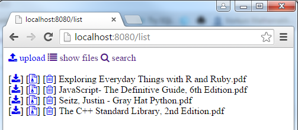
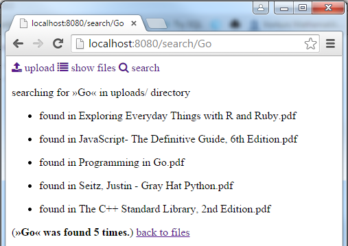

### Project:
simple and fast document / file management server written in go





### Features:

- web interface to upload files
- automatically unzips zip files
- automatically untars tar and tar.gz files
- search for a string within (all) filetypes 

### Todo:
- recursive folder listing (walkpath)
- enhance tar/untar function
- filter out binary files
- permissions / login system
- beautify

### Requirements:
- Go installed and GOPATH set correctly

###### CREDITS:
- written by Daniel Geers ( geers[-at-]cs[-dot-]uni-frankfurt[-dot-]de )
- use of open source project "font awesome" (menu icons)
- tar/untar: Summerfield, Mark. Programming in Go. Addison-Wesley 2012.


### DOCUMENTATION / SERVER API: #

##### baseurl = localhost, port = 8080
```bash
API-Style: <baseurl>:<port>/<command>/<argument>

<baseurl>:<port>/delete/<filename> ** deletes a file from upload directory,
									  prints an error if not existing 
<baseurl>:<port>/search/<string>   ** searches for a <string> in all files
									  within the upload dir. returns all hits.
									  ignores all files except txt
<baseurl>:<port>/list              ** file operations
<baseurl>:<port>/files             ** simply lists all files 
<baseurl>:<port>/upload            ** landing page with menu and upload form.
                                      automatically extracts *.zip and 
									  *.tar.gz files into the webserver's base 
									  upload dir
<baseurl>:<port>/zip/<filename>    ** compresses a file into format zip and
      	  						      shows a download link
<baseurl>:<port>/tar/<filename>    ** compresses a file into tar.gz format and
									  shows a download link
<baseurl>:<port>/download/<file>   ** forces download in browser       
```
---


